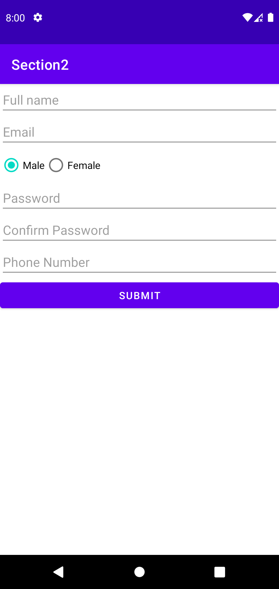

# __Android Registration Form__
This is a simple Android registration form that collects user information such as full name, email, gender, password, confirm password, and phone number. It also includes a submit button that logs the user's name to the console when clicked.

## __Getting Started__
To use this project, you will need to have Android Studio installed on your computer. Once you have downloaded the project files, you can open the project in Android Studio and run it on an Android emulator or device.

## __Prerequisites__
- You will need to have Android Studio installed on your computer. You can download it from [here](https://developer.android.com/studio/).
- Android emulator or device

## __Installing__
1) Clone or download the project files.
2) Open the project in Android Studio.
3) Run the project on an Android emulator or device.

## __Usage__
1) Enter your full name, email, gender, password, confirm password, and phone number in the corresponding fields.
2) Click the submit button to log your name to the console.

## __Code Snippets__
The `activity_main.xml` file contains the XML layout for the registration form. It includes EditText fields for the user's full name, email, password, confirm password, and phone number, as well as a RadioGroup for selecting the user's gender.

The `MainActivity.java` file contains the Java code that handles the submit button click event. It retrieves the value of the full name EditText field and logs it to the console using __`System.out.println()`__.

## __Screenshots__
<!-- change image dimensions -->
